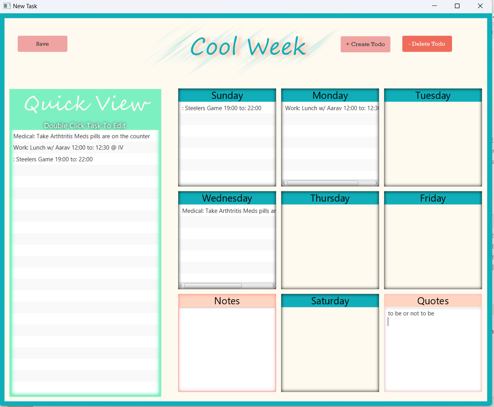

# Soulful Scribbles: Your Personalized Task & Event Manager

Are you seeking a simple and efficient way to organize your tasks, events, and notes? Welcome to Bullet Journal Planner, the digital taskmaster that makes life management a breeze.

Inspired by the ever-popular bullet journaling technique, this app brings together an intuitive user interface and a multitude of features to ensure your personal and professional life stays on track.

# Features:

- Custom Week Management: Plan and manage your week according to your unique lifestyle. Set your maximum tasks and events, and create a personalized structure that caters to your needs.

- Task Creation & Organization: Add, edit, and delete tasks with ease. Prioritize your tasks and allocate your time wisely.

- Persistence: With Soulful Scribbles, you can save as many weeks as you want!

- Task View: In a hurry? Quickly view all your todos in one place!

- Renaissance man? Assign each todo its own category!

- Note-Taking & Hyperlink Integration: Enhance your tasks and events with detailed notes. Plus, our smart algorithm automatically detects and converts URLs into clickable hyperlinks within your notes for easy access.

- Made a mistake? Are you a mistake? Quickly edit tasks by popping open a task Mini-Viewer and edit todos directly! (Mind-Changes)

- Made a big Mistake? Quickly erase todos by selecting them and clicking delete todo!

- Loading Screens: Enjoy smooth navigation with our loading screens during directory selections and week submissions.

- Enjoy a beautiful UI design that is the nexus between Corporate America and a Cool Summer Breeze ;)

Bullet Journal Planner is your all-in-one digital organizer that simplifies your task management while providing you the flexibility to personalize your schedule. Whether you're a student, a professional, or simply someone looking to better manage their time, Bullet Journal Planner is designed for you.

Download Bullet Journal Planner today, and transform the way you plan your day!

# SOLID PRINCIPLES
## S- Single Responsibility Principle
- In our project we used the Command design pattern. The Command design pattern lets us program each button's responsibility in its own class. This keeps each class seperate and only responsible for its own command's code. Therefore, adhering to the Single Responsibility Principle.
## O- Open for Extension, closed for modification
- Our Bullet Journal Planner application effectively implements the 'O' (Open-Closed Principle) in SOLID through the use of the ToDo abstract class. The ToDo abstract class forms the basis for different kinds of tasks and events that our planner can handle, allowing for easy extensibility. Any new types of tasks or events can be added to the system by simply creating a new class that extends the ToDo class, without needing to modify the existing codebase.
## L- Liskov's Substitution 
- In the case of our application, a Task or an Event can be used wherever a ToDo is expected. Both classes can be substituted for ToDo without altering the correctness of the program. This allows us to handle tasks and events in a uniform manner, leveraging polymorphism.
## I- Interface Segregation
- The Interface Segregation Principle (ISP) in our project is implemented through the creation of specific Command interfaces for each user action. Classes like SubmitWeekCommand and OpenDirectoryCommand each represent a particular functionality, implementing a subset of the application's overall capabilities. This adherence to ISP not only simplifies dependencies but also enhances the code's modularity and adaptability, making it more maintainable.
## D- Dependency Injection
- For all classes in our Controller package, we had a "master controller" called AppContext. Appcontext held on to important fields that were need sby all classes in the controller. We used dependency injection to our advantage, by creating an intial AppContext instance in the driver and injecting it into each class in the controller package.

# How we could extend:
- Because we've used the Command design pattern and created seeperate controllers for each scene. Adding any new scenes with any number of events would be easy. It would require little to no modification and would just be extensible by creating a scene, controller, and its commands.